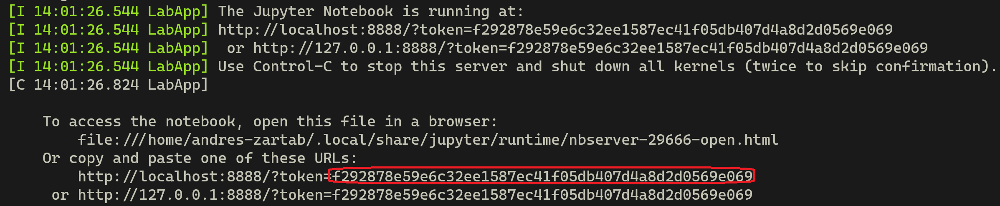

# Deploying a Deep Learning model
 
## we can use this repo to understand how to deploy a simple YOLO object detection model using fast API

To clone the repo use this command:
```bash
git clone https://github.com/https-deeplearning-ai/machine-learning-engineering-for-production-public.git
```

or for cloning via SSH use:
```bash
git clone git@github.com:https-deeplearning-ai/machine-learning-engineering-for-production-public.git
```

If we are unsure which method to use for cloning, use the first one.

The `cd` command allows we to change directories. Assuming we are at the directory where we issued the cloning command, type the following on wer terminal.
```bash
cd machine-learning-engineering-for-production-public/course1/week1-ungraded-lab
```
This will bring we to the `week1-ungraded-lab` directory. The `ls` command allows we to list the files and directories.
Type `ls` and let's take a quick look at the content inside `week1-ungraded-lab` directory:
 
```
.
└── week1-ungraded-lab (this directory)
    ├── images (includes some images from ImageNet)
    ├── server.ipynb (Part 1 of the ungraded lab)
    ├── client.ipynb (Part 2 of the ungraded lab)
    └── requirements.txt (python dependencies)
```
 
 
Python Virtual Environment with Conda

### 1. Creating a virtual Environment
 
Now we assume that we either successfully installed conda or that it was previously available in our system. The first step is  creating a new developing environment. Let's set a new environment with python 3.8 with this command:
 
```bash
conda create --name mlep-w1-lab python=3.8
```
 
After successfully creating the environment, we need to activate it by issuing this command:
 
```bash
conda activate mlep-w1-lab
```
 
At this point, we will do all wer libraries installation and work in this environment. So, whenever working on this ungraded lab, check the mlep-w1-lab environment is active.

**Note**: If we have a Mac M1 then read this [guide](./mac_m1.md) before doing the next steps or try the version of this lab that is hosted in Coursera.
 
### 2. Installing dependencies using PIP 
 
Before proceeding, double check that we are currently on the `week1-ungraded-lab` directory, which includes the `requirements.txt` file. This file lists all the required dependencies and their respective versions. 

If we are on a Mac M1 be sure to have installed Tensorflow and OpenCV as described in the [guide](./mac_m1.md) and deleted these libraries from the `requirements.txt` file.

Now use the following command to install the required dependencies:
 
```bash
pip install -r requirements.txt
```
 
This command can take a while to run depending on the speed of our internet connection. Once this step completes we should be ready to spin up jupyter lab and begin working on the ungraded lab.
 
### 3. Launching Jupyter Lab
 
Jupyter lab was installed during the previous step so we can launch it with this command:
```bash
jupyter lab
```
After execution, we will see some information printed on the terminal. Usually we will need to authenticate to use Jupyter lab. For this, copy the token that appears on wer terminal, head over to [http://localhost:8888/lab](http://localhost:8888/lab) and paste it there. The terminal's output should look very similar to the next image, in which the token has been highlighted for reference:





### 4. Running the notebook
 
Within Jupyter lab we should be in the same directory where we used the `jupyter lab` command.
 
Look for the `server.ipynb` file and open it to begin the ungraded lab.

To stop jupyter lab once we are done with the lab just press `Ctrl + C` twice.
 
### And... that's it! Have fun

To stop the container once we are done with the lab just press `Ctrl + C` twice. This will also delete the container.
 

